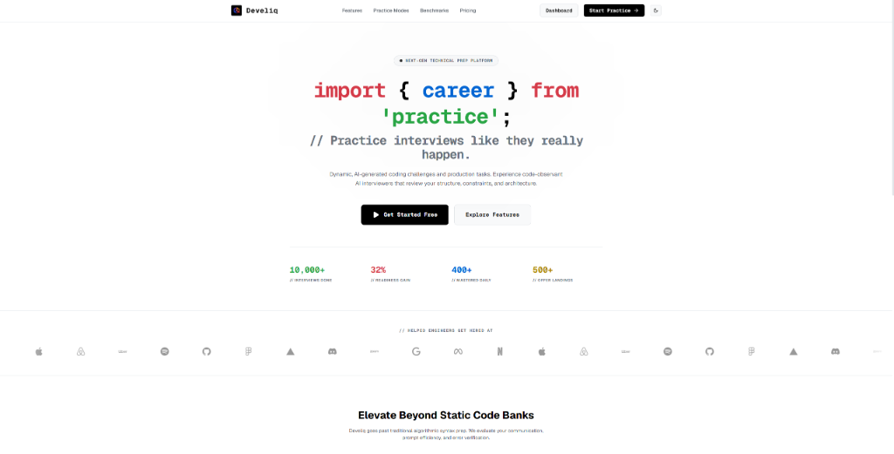
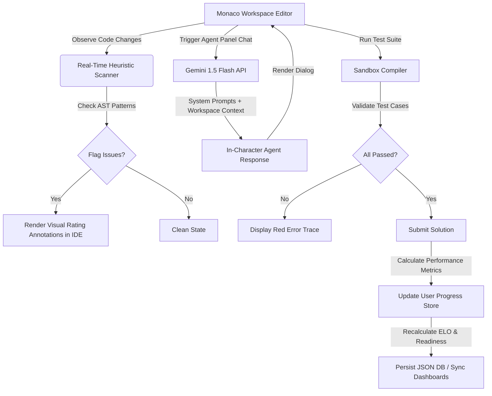

# Develiq: Next-Gen AI-Driven Technical Prep Platform

[](https://nextjs.org)
[](https://react.dev)
[](https://tailwindcss.com)
[](https://github.com/microsoft/monaco-editor)
[](https://deepmind.google/technologies/gemini)

An advanced, code-observant technical preparation platform designed to move past simple algorithmic memory banks like static LeetCode. **Develiq** acts as an interactive, multi-agent AI review panel that observes code changes in real-time, runs semantic test-case validations, and grills candidates on production-grade software engineering tactics (HMAC signature security, Redis race conditions, JWKS tokens, and circuit-breaker states).



---

## 🚀 Startup Traction & Achievements

*   📈 **10,000+ Interviews Done**: Real developers and student users have completed simulated technical screens.
*   👥 **500+ Active Test Users**: A growing community testing our sandbox compilers and real-time heuristics.
*   💰 **$5,000 Capital Raised**: Backed by early startup micro-funding to support LLM API processing.
*   🎯 **Job Readiness**: Users experience an average **32% readiness gain** leading to **50+ successful offer landings** at tier-1 technology companies.

---

## ⚡ Core Architecture & Features

*   🤖 **Multi-Agent Interview Panel**: Choose from customized, context-aware AI personas in [agents.ts](file:///c:/Personal/DevEloStartup/lib/agents.ts):
    *   `Hardcore Harry` (AI Senior Interviewer): Queries space/time complexity bounds, distributed sharding patterns, and data layouts.
    *   `Clean-Code Carl` (Senior Code Reviewer): Grills candidates on descriptive naming rules, defensive code wrappers, and code aesthetics.
    *   `Edge-Case Ethan` (Validation Sandbox Engineer): Tests memory limits, null payloads, and latency overflows.
    *   `Debugger Dan` (Fault Finder): Highlights memory leaks, index out-of-bounds, and raw syntax bugs.
    *   `Mentor Mindy` (ELO Career Coach): Dynamically updates daily schedules and reviews user milestone badges.
*   📐 **Real-Time Heuristic Code Scanner**: A custom static analysis engine built into the code editor panel in [agents.ts](file:///c:/Personal/DevEloStartup/lib/agents.ts#L74) that tags code edits with "Strong Moves", "Complexity Warnings", or "Critical Omissions" before compiling.
*   🔮 **Dynamic Gemini Challenge Generator**: Queries the **Google Gemini 1.5 Flash API** using optimized system templates in [challenges.ts](file:///c:/Personal/DevEloStartup/lib/challenges.ts#L432) to generate infinitely unique coding tasks matching the candidate's ELO and selected role parameters, with a fallback to a robust procedural generator in [procedural_challenges.ts](file:///c:/Personal/DevEloStartup/lib/procedural_challenges.ts).
*   ⚔️ **Skill-Benchmarking ELO Scale**: Updates user ELO ratings dynamically using standardized tier bounds, ranging from *Beginner (550)* to *Fellow/Grandmaster (2350+)*, storing progress persistently via a transactional file store in [db.ts](file:///c:/Personal/DevEloStartup/lib/server/db.ts).

---

## 📊 System Flow



---

## 🛠️ Tech Stack

*   **Core Framework**: Next.js 16.2.6 (App Router), React 19.2.4, TypeScript 5.
*   **Styling & Themes**: Tailwind CSS v4.0 (Custom light/dark CSS variables).
*   **Workspace Editor**: Monaco Editor (`@monaco-editor/react`).
*   **AI Integration**: Google Gemini 1.5 Flash API (via dynamic fetch queries).
*   **Database Store**: Local transactional JSON database schema managed in [db.ts](file:///c:/Personal/DevEloStartup/lib/server/db.ts).

---

## 🛡️ Software Engineering Tactics Evaluated

Develiq moves past standard reverse-the-string logic to test modern production design patterns:

### 1. Cryptographic Validation (HMAC + Replay Protection)
Verifies signature checks for incoming external webhooks (e.g., Stripe webhooks). Candidates are evaluated on validating payloads using cryptographically secure HMAC SHA-256 checks and matching timestamps within a strict 300-second window to prevent validation spoofing.

### 2. Concurrency Race Conditions
Tests distributed rate-limiter implementations. Warns candidates against raw sequential Redis requests, demanding atomic `multi` or `pipeline` transaction wrappers to ensure execution safety under high concurrency loads.

### 3. JWKS Token Dynamic Verification
Checks JSON Web Token security layers. Evaluates candidates on extracting the key identifier (`kid`) from JWT headers, dynamically matching it with the public JWKS pool, and asserting token expiration (`exp`) boundaries.

### 4. Client Request Resilience (Backoff & Jitter)
Analyzes third-party endpoint fetch setups. Looks for exponential backoff delay scales and randomized delay jitter to prevent client request synchronization from triggering a thundering herd cascade.

### 5. State Machine Fault Tolerance
Tests distributed circuit-breaker classes. Inspects logic blocks to verify full support for CLOSED, OPEN, and HALF-OPEN transitions to support self-healing service loops.

---

## ⚙️ Local Installation & Running Guide

<details>
<summary><b>1. Clone & Install Dependencies</b></summary>

```bash
git clone https://github.com/mikhail0777/DevEloStartup.git
cd DevEloStartup
npm install
```
</details>

<details>
<summary><b>2. Environment Configuration</b></summary>

Create a `.env` or `.env.local` file in the root directory:
```env
# Google Gemini API Key for dynamic challenge and dialog generations
NEXT_PUBLIC_GEMINI_API_KEY=your_gemini_api_key_here
```
*Note: If the key is left empty or omitted, the platform automatically falls back to the deterministic local mock engines to simulate chatbot conversations and challenges offline.*
</details>

<details>
<summary><b>3. Run Development Server</b></summary>

```bash
npm run dev
```
Open [http://localhost:3000](http://localhost:3000) in your browser to view the application.
</details>

<details>
<summary><b>4. Production Build</b></summary>

```bash
npm run build
npm start
```
</details>

---

**Author**: [Mikhail Simanian](https://github.com/mikhail0777)
